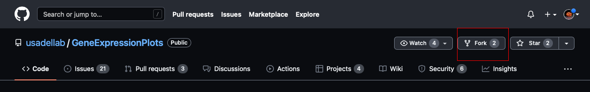
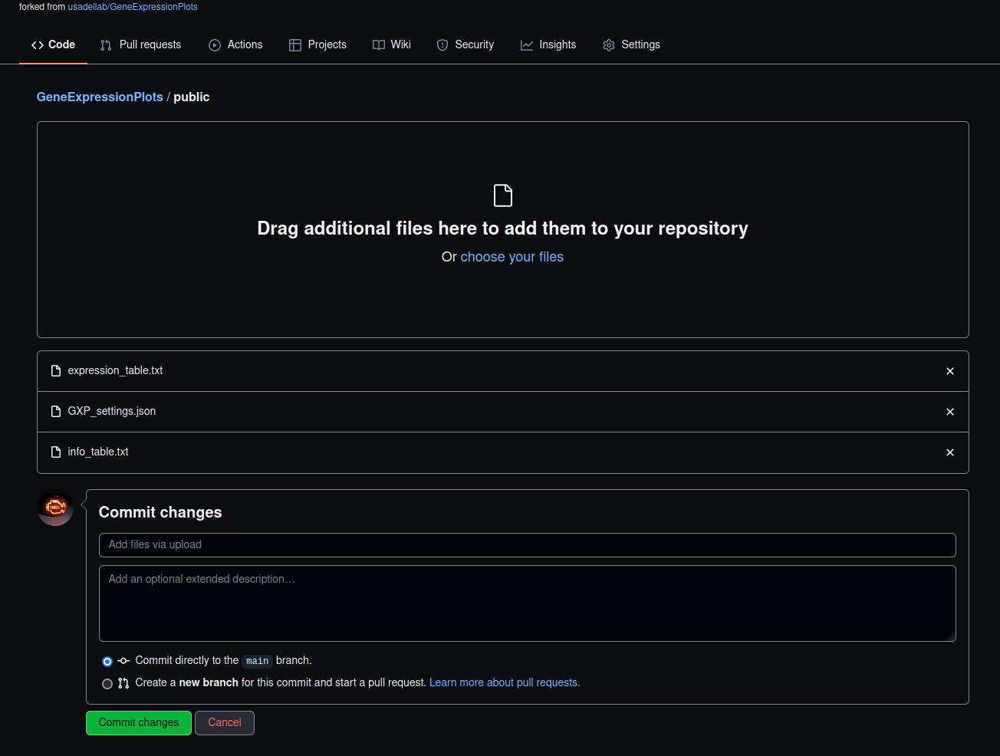
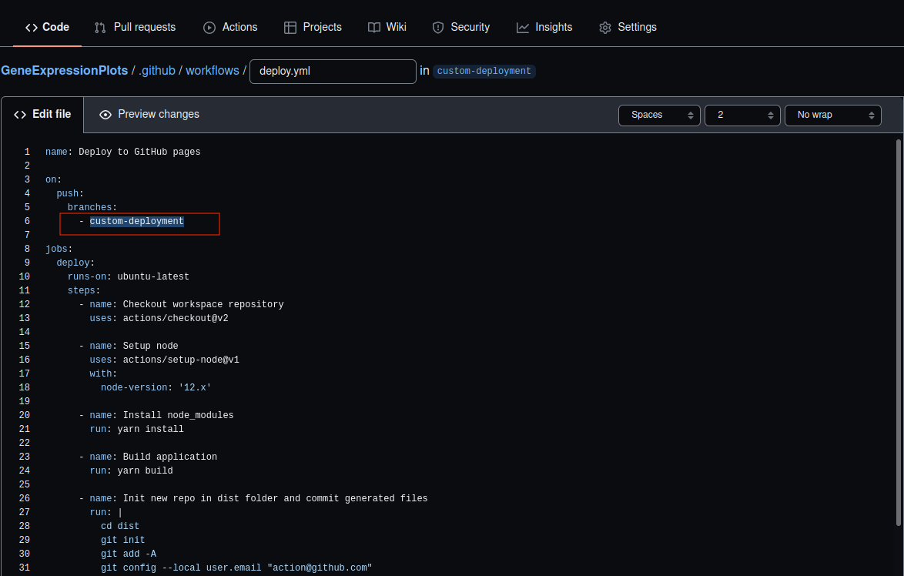
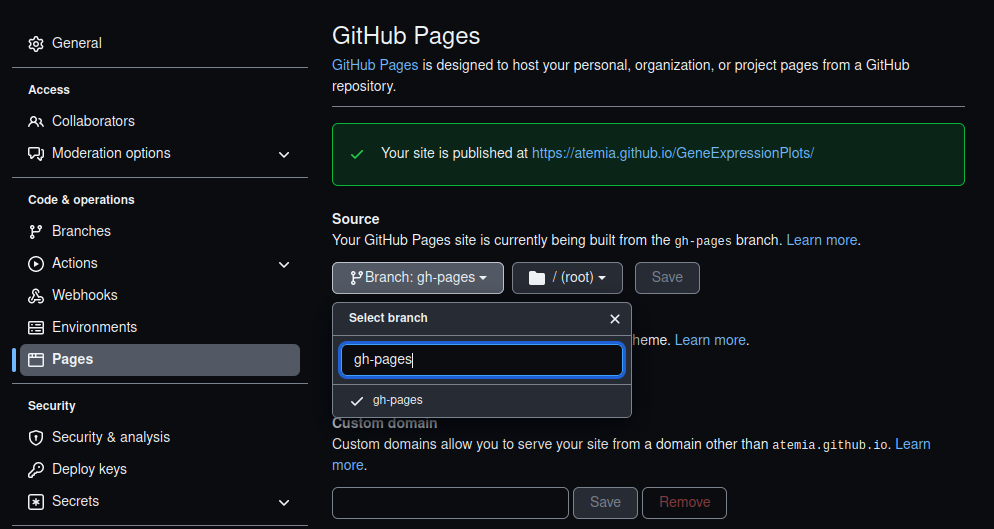
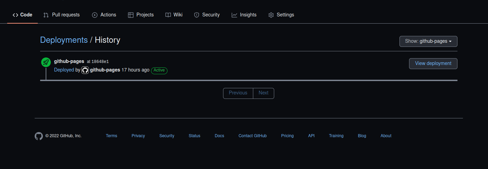

# Deployment

## Preloading your data

It is possible to compile the application in _preload_ mode. To do this, the **data, configuration** and optionally **meta data** and image can be provided.

### Preload File Format

The format of the preload files is the same as the files you can upload directly via the application.


&#x20;To generate files that you can use for preloading you can export your application data into a GXP database and use those files for preloading


&#x20;A special file is the **settings JSON** file needed to preload data. When exporting a GXP database this file will be automatically generated. It will look something like this:

```javascript
{
  "unit": "raw",
  "expression_field_sep": "\t",
  "expression_header_sep": "*",
  "info_field_sep": "\t",
  "groupOrder": [
    "Heat-Shock: Apical",
    "Heat-Shock: Meristem"
  ],
  "sampleOrder": [
    "DAS-1",
    "DAS-2",
    "DAS-3"
  ]
}
```

You can set meta data and settings for plotting needed for preloading your data here.


This file is mandatory for preloading the application with your data


### Compiling with data

To compile the application in preload mode, a few environment variables are read at compilation time, each pointing to a file path within the `static` folder located in the root application folder.

* `VITE_PRELOAD_DATA`: set this variable to preload an expression **data table**.
* `VITE_PRELOAD_IMAGE`: set this variable to preload a custom **image** from a separate file.
* `VITE_PRELOAD_INFO`: set this variable to preload expression **meta data table.**
* `VITE_PRELOAD_SETTINGS`: set this variable to preload specific configuration **settings**.
* `VITE_PRELOAD_PLOTS`: set this variable to preload previously plotted **plots**.
* `VITE_PRELOAD_ENRICHMENTS`: set this variable to preload previously run **enrichment analyses**.

The variables can be exported directly using the command-line interface.

```bash
PRELOAD_DATA="path/to/file.json" npm run build
```

Or set it in a `.env.development` or `.env.production`file located in the application root folder.&#x20;


```
VITE_PRELOAD_DATA="path/to/file"
VITE_PRELOAD_IMAGE=""
VITE_PRELOAD_INFO=""
VITE_PRELOAD_SETTINGS="
VITE_PRELOAD_PLOTS=""
VITE_PRELOAD_ENRICHMENTS=""
```


## A guide to deploy the app with your personal data and plots on GitHub pages (gh-pages)

This guide aims at giving step-by-step instructions on how to deploy a version of the GeneExpressionPlotter already preloaded with your individual data and plots using GitHub pages. This is a great way to showcase and share your data and visualizations.

#### Prerequisites

* [GitHub account](https://github.com).
* GXP database.&#x20;


You can generate the GXP database by loading your data in the [GXP tool](https://usadellab.github.io/GeneExpressionPlots/) then using the `Export GXP Database` option in the data page of the app.


### Step-by-step guide

#### Step 1: Fork the GXP repository

Sign in to your Github account and [fork](https://docs.github.com/en/get-started/quickstart/fork-a-repo) [GeneExpresionPlots](https://github.com/usadellab/GeneExpressionPlots)(GXP) repository.



#### Step 2: Prepare the data

Set up your preloaded data. The simplest way to do this is to go to our Sandbox [https://usadellab.github.io/GeneExpressionPlots/](https://usadellab.github.io/GeneExpressionPlots/#/data), load your data, visualize the data via the available plots, run any enrichment analyses you want and export the data via the **Export GXP Database** menu under the **Data** panel. Include plots and enrichment analysis analysis you conducted by checking the optional "**Export Plots**" and "**Export Enrichments**". That would be the fifth icon labeled with an upward arrow box icon. This will download a `zip` that contains everything you need to preload your personalized deployment.


#### Step 3: Upload data to `custom-deployment` branch

Unpack/extract the downloaded zip. Switch to the `branch` `custom-deployment` and upload the contents of the unpacked folder into the `/public` folder of the **forked repository.** You can use the Add file button on GitHub and add files contents by dragging them from your local computer or you can use the choose file option. Commit your changes after uploading all the extracted files.&#x20;


If you have plots or enrichment analysis exported GXP database, upload them separately to the plots folder `/public/plots` and  `/public/enrichment_analyses` respectively




#### Step 4: Define the environment variables based on uploaded files

Set the environment variables in the `.env.production` file in your **forked repository**. The default `BASE_URL` of the deployment will be `/GeneExpressionPlots` . The paths have to represent this as well:


```
VITE_APP_TITLE="GXP"
VITE_PRELOAD_DATA="/GeneExpressionPlots/expression_table.txt"
VITE_PRELOAD_IMAGE="/GeneExpressionPlots/image.png"
VITE_PRELOAD_INFO="/GeneExpressionPlots/info_table.txt"
VITE_PRELOAD_SETTINGS="/GeneExpressionPlots/GXP_settings.json"
VITE_PRELOAD_PLOTS="/GeneExpressionPlots/plots.json"
VITE_PRELOAD_ENRICHMENTS="/GeneExpressionPlots/enrichment_analyses.json"
```



**Delete** any files that are not present in the Gxp database unzipped folder from the `.env.production` file. For instance, if you do not have any plots delete the `VITE_PRELOAD_PLOTS="/GeneExpressionPlots/plots.json" line.`

It is possible to directly [edit on Github (click on the pencil button to edit)](https://docs.github.com/en/repositories/working-with-files/managing-files/editing-files). Once you are done editing, use the Commit changes option to save the changes.


#### Set 5: Set up the workflow file

Open the`/.github/workflows/deploy.yml` file to edit.

Change `line 6` under `branches`, change  **`main` ** to **`custom-deployment`**  &#x20;

Commit the changes.



#### Step 6: Set up Github pages

[Configure a publishing source for your GitHub pages site](https://docs.github.com/en/pages/getting-started-with-github-pages/configuring-a-publishing-source-for-your-github-pages-site) by following the guides on GitHub. When setting up the GitHub pages, select the `Source` branch to gh-pages as shown:



#### Step 7: GitHub will automatically compile Typescript to Browser JS for you

A version of the GeneExpressionPlotter, customized to your data should now be publicly available on GitHub pages. You should see the deployment in the sidebar of your forked GitHub repository home page


This enables people to see and analyze your data directly from their web-browser. They can even run their own experiments and visualizations for your data and export it themselves. You can view the deployment by clicking the GitHub-pages link shown in the above screenshot then clicking the `View deployment` option shown in the screenshot below.\




That's it.&#x20;


The data you publish on gh-pages and this way it is kept as a static asset and publically available on GitHub. Any time you refresh the site it will go back to the state you deployed it in.



The GeneExpressionPlotter is fully static. You can deploy it for free on Github pages. Also, you can download code (or a specific release) anywhere where you can deploy static content (any static web-server). It doesn't have to be GitHub pages.

