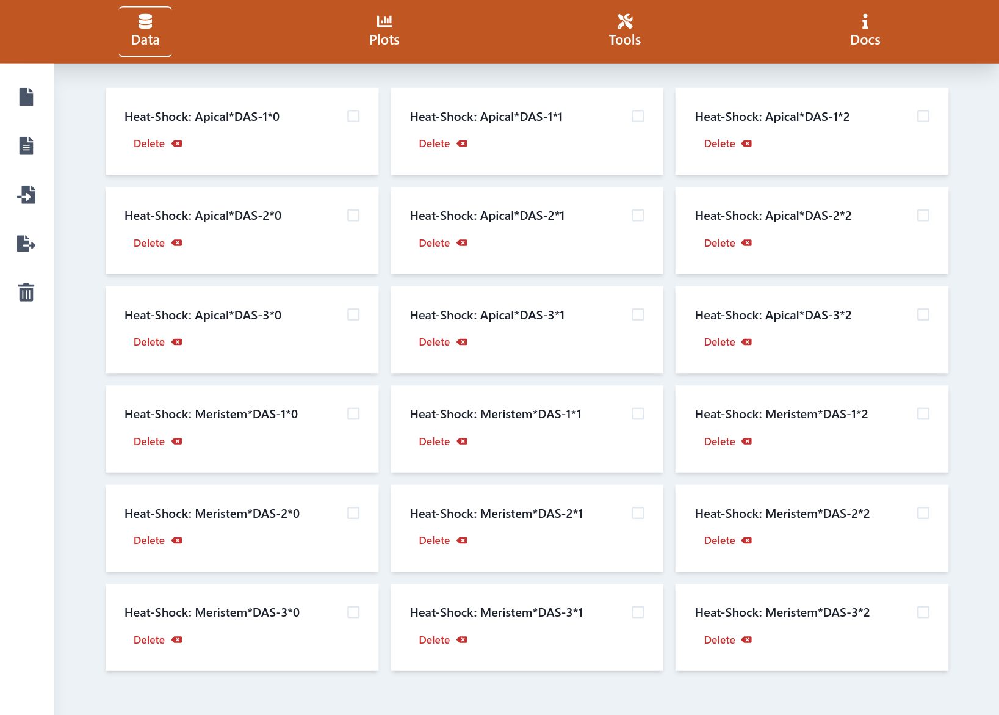

# User Manual

## Quick start

To get a quick idea of what you can do with "Gene Expression Plotter (GXP)", some example data is included in the application itself.&#x20;


[Open GXP in your browser](https://usadellab.github.io/GeneExpressionPlots) and click `Load example data` in the center of the page.


## Example data

If you want to have a look at how input files and tables for GXP have to look like, go to [this `examples` directory on our repository](https://github.com/usadellab/GeneExpressionPlots/tree/main/examples) and have a go at the following files.

* [**`gxp_data.zip`**](../../../examples/GXP\_data.zip): Any time you want to save your work, that is your loaded data, plots you already generated, and analyses you already carried out, you can export (save) your work to a simple archive ([ZIP file](https://en.wikipedia.org/wiki/ZIP\_\(file\_format\))). This "gzp\_data.zip" archive is an example of such an export with mock data, gene feature information like differential expression and Gene Ontology terms, and a custom plot legend. The archive can be loaded via the `Import GXP Database` menu in the `Data` page sidebar.
* [**`upload_expression_table.tsv`**](https://github.com/usadellab/GeneExpressionPlots/blob/master/examples/upload\_expression\_table.tsv): You can provide expression counts and information about biological factors associated with your sequenced samples in a custom expression table that you generated in any Spreadsheet program, like e.g. Microsoft Excel. Here you find an example of how such a custom expression count table has to look like to be interpretable by the GXP application. Load it using the `Load Expression Table` menu in the `Data` page sidebar.
* [**`upload_info_table.tsv`**](../../../examples/upload\_info\_table.tsv): This custom table provides any information you might want to publish and use in plot captions about your transcripts (genes). The table can have any number of columns and typically should relate detailed information to transcript identifiers, like short human readable descriptions, Gene Ontology terms, results from differential gene expression analyses and more. The table can be loaded into GXP via the `Load Gene Info Table` menu in the `Data` page sidebar.
* [**`new_image.png`**](https://github.com/usadellab/GeneExpressionPlots/blob/master/examples/new\_image.png): This is a custom legend in the form of an image. It will be shown above your plots. Load it via the `Image` menu in the `Plots` **** page sidebar.

## Important hints


DO NOT EVER RELOAD THE PAGE, YOUR CURRENT SESSION DATA WOULD BE LOST.



Currently, there is no way to modify uploaded data or created plots. Data and plots can be removed and then loaded/created again.


## Terminology

Before we go into detail about how your data should be provided, how to generate plots, and how to run analyses, we need to agree on a certain terminology. Assume you have sequenced RNA extracted from different tissues and have biological replicates of these extracts, typically three.&#x20;

### Experimental conditions, factors

Some of your RNA-extracts have different biological conditions ("factors") than others. For example some RNA-extracts are obtained from leaf tissue, while others are from the apical meristem of you plants. Or some RNA-extracts are from control conditions and others were submitted to heat shock. These conditions are called factors; here: "tissue" with values "leaf" and "meristem", and "treatment" with values "control" and "heat shock". For each unique combination of factor-values, e.g. "control condition" and "leaf", one typically has sequenced three biological replicates of RNA-extracts. This is done to tell system inherent biological variation in gene expression, the noise, from the variation that interests you, for example the differences in gene expression comparing control with heat shock treated RNA-samples in the leaf. Often, a time series is sequenced, e.g. RNA-extracts are obtained 0, 5, and 10 days after heat shock treatment ("DAS"). In order to generate informative plots that visualize gene expression in the context of these factors, we define the following terms.&#x20;

* **REPLICATE**: Typical for **RNA-Seq** experiments is the requirement of biological replicates to obtain robustness of results against noise. A **replicate** represents a single measurement of gene expression counts from a specific RNA-extract. In the context of this application, a **replicate** thus **** is a single count table produced by typical RNA-Seq analysis tools (e.g. [**Kallisto**](https://pachterlab.github.io/kallisto/), [**Sailfish**](https://www.cs.cmu.edu/\~ckingsf/software/sailfish/), [**Salmon**](https://combine-lab.github.io/salmon/), [**Tophat**](https://ccb.jhu.edu/software/tophat/index.shtml), or [**Bowtie**](http://bowtie-bio.sourceforge.net/index.shtml)).
* **SAMPLE**: A collection of **one or more replicates** derived from a single source and under certain conditions, e.g. the sample "0 DAS" is used for replicates (see above) of RNA extracted after zero days after exposure to the heat shock. Please note, that different **samples are mapped** **to** different **points on the x-axis** in gene expression plots. You can thus use samples like "0 DAS", "5 DAS", "10 DAS" to position your counts on the x-axis of the plots. Samples refer to specific values of factors; here days after exposure to shock of the factor "time".
* **GROUP**: A collection of **samples** under a specific experimental condition (factor-value), e.g. RNA extracted from leaves or the apical meristem, or RNA extracted from control plants versus heat shock treated plants. A group in the GXP application contains one or more samples. Note that **groups define the color in** gene expression bar or curve **plots**.


All **groups**, **samples**, and **replicates** must contain the same gene accession identifiers.


.svg>)

**Figure 1**: Example gene expression plot. Expression is compared between groups; "Heat shock: Apical" (red) and "Heat shock: Meristem" (green), respectively. Samples are positioned on different points on the x-axis, depending on the time after exposure to heat shock, DAS-1, DAS-2, and DAS-3, respectively. Error bars indicate standard deviation found within each distinct sample, that is between three replicates sharing the same factors, e.g. "Heat shock: Apical" (red) at DAS-1 (first position on x-axis).

## Loading Data

Data loading is done on the `Data` page of the app. There are **three** different ways of uploading your data to the application.


All data is private to your browser session. No data will be uploaded to the internet. Once the application is loaded it is possible to go offline and it will still work normally.


### From A Custom Expression Table


Please, refer to the [terminology ](./#terminology)section for the meaning of **group**, **sample**, and **replicate**.


To ease the process of loading data into the application, we use a custom tabular file format with a multi-dimensional header consisting of three segments, where each column represents a combination of a **group**, **sample**, and **replicate** data counts.

The table must be composed using the following format:

* It must have a header row.
* The first column corresponds to the gene **accession** ids. This is the only column that can be arbitrarily named.
* Each of the remaining columns corresponds to a single **replicate**. That is, all counts for that replicate are represented as a single column.
* Each replicate column is a composite name composed of three segments: the **group**, **sample**, and **replicate** name. Each name is separated by a custom delimiter (asterisk **`*`** by default). For example, **Heat Shock: Apical**\***DAS-1\*0**.&#x20;

```
Accession               Group1*Sample1*Replicate1    Group1*Sample1*Replicate2    ...    Group<i>*Sample<j>*Replicate<k> 
PGSC0003DMT400039136                      70.9448	                     70.9448                                   71.9448
PGSC0003DMT400058594                      130.021	                     131.021	                                 131.021
...                                           ...                          ...                                       ...
```


An example file is available in the repository: [`upload_expression_table.tsv`](https://github.com/usadellab/GeneExpressionPlots/blob/master/examples/upload\_expression\_table.tsv)``


### **From Previously Exported Data**

After loading data for a gene expression project, the `Export GXP Database` **** menu in the `Data` page sidebar allows the user to save the uploaded data to a packaged **** ZIP file. This data can be reloaded using the `Import GXP Database` menu. You can choose a name, table delimiter and optionally whether you want to also export your plots and analyses into the exported **GXP Database.** All data, plots, and analyses will be loaded if you import the previously exported ZIP.


An example file is available in the repository: [gxp\_data.zip](../../../examples/GXP\_data.zip)


### From Replicate Tables

If you do not want to provide a single custom expression count table or have a previously exported GXP Database, you can generate the required input table from your expression counts, replicate by replicate, i.e. count table by count table, respectively (see [the terminology section](https://app.gitbook.com/@zendro-dev/s/geneexpressionplots/\~/drafts/-Mjo072AXscM-iiZU056/documentation/user-manual#terminology)). This cannot be done efficiently in your web browser, but you can do it using one of the following approaches.&#x20;

1. Generate the GXP count input table in a Spreadsheet program (see [above section "From a custom expression table"](./#from-a-custom-expression-table) for details on the expected format).
2. Use the terminal to generate the table from your raw count tables (see [these simple and detailed instructions](https://zendro-dev.gitbook.io/geneexpressionplots/documentation/user-manual/generate-custom-expression-table-from-quantified-rna-extracts)).

### Verify Loaded Data

Once the data is loaded, the replicate names will appear on the **Data** page.



## Loading Gene Info

Loading meta information about your genes is done via the **Data** page of the application. The gene info table uses the same format as the data table above, only there is no need for a custom delimiter to separate the header into replicates. Ideally the table contains the same accession identifiers as the data table so the raw expression data and the meta data can be linked. An example of a info table could look like this:

```
Gene-ID	Diff.          Gene.Exp	MapMan-Bins	Pfam-Domains	    Gene-Ontology	            WT_vs_treated pValue
PGSC0003DMT400039136	true	    1.3.4.5	    PF392847,PF23943	GO:894389 and GO:383847	  0.0005
PGSC0003DMT400039134	false	    1.3.4.6	    PF392848,PF23944	GO:894390 and GO:383848   0.001
...                   ...       ...         ...               ...                       ...
```

You can upload this table in the same ways you upload your data table (see above)

### From custom table

Once you have a table according the above specification you can upload it via the **Load Gene Info Table** menu in the **Data** page sidebar.&#x20;

### From previously exported data

Check the section on how to [upload expression data from previously exported data](https://zendro-dev.gitbook.io/geneexpressionplots/documentation/user-manual#from-previously-exported-data). The Gene info table works the same way. If it is present in your uploaded `zip` file, the app will load it.

### Verify Loaded Data

You can very if the uploaded data is correct by checking the [Gene Browser Tool](https://zendro-dev.gitbook.io/geneexpressionplots/documentation/user-manual/gene-browser). This should contain all your uploaded genes and their meta data presented nicely in a list.


## Plotting

GeneExpressionPlotter enables you to plot various different visualizations of your data. For detailed documentation of the functionality, see [Plots](https://zendro-dev.gitbook.io/geneexpressionplots/documentation/user-manual/plotting).

## Tools

GeneExpressionPlotter supports a growing number of tools to inspect, understand and even analyzie your data.&#x20;

### Gene Browser

The gene browser tool enables you to search and inspect the data and meta-data you uploaded for your genes. For detailed documentation of the functionality, see [Gene Browser](https://zendro-dev.gitbook.io/geneexpressionplots/documentation/user-manual/gene-browser).

### Enrichment analysis

The enrichment analysis tool allows you to run an enrichment analysis on your meta-data. For detailed documentation of the functionality, see [Enrichment analysis](https://zendro-dev.gitbook.io/geneexpressionplots/documentation/user-manual/enrichment-analysis).

### Mercator

The Mercator tools allow you to run and load MapMan functional annotations for your transcripts via [Mercator v4](https://plabipd.de/portal/mercator4) into the GXP. For detailed documentation of the functionalities, see[ ](https://zendro-dev.gitbook.io/geneexpressionplots/documentation/user-manual/mapman-functional-annotations)[MapMan functional annotations](https://zendro-dev.gitbook.io/geneexpressionplots/documentation/user-manual/mapman-functional-annotations).

For more information about the MapMan ontology see the latest [MapMan publication](https://www.sciencedirect.com/science/article/pii/S1674205219300085).&#x20;
