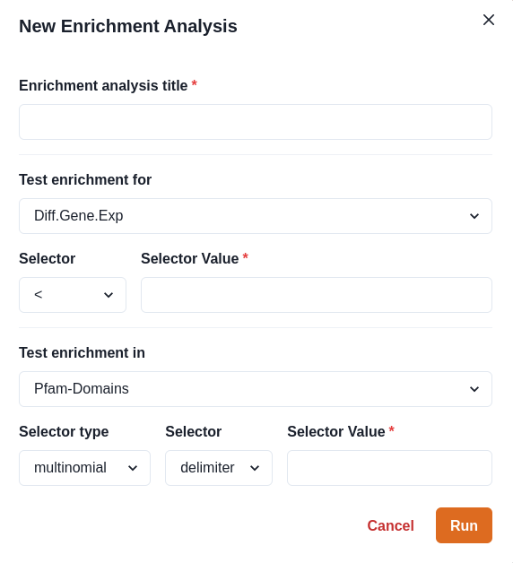
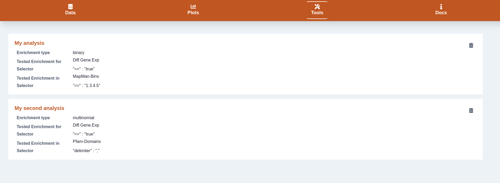

# Enrichment analysis

The enrichment analysis tool allows you to run an enrichment analysis on your meta-data (The info table you can upload via the data tab).

## Form

The form has several options to select.

#### Test enrichment for

This input is for selecting a column of your meta data table to run the enrichment test for. Directly below you choose a selector and a selector value to determine which rows of the table you want select.

Alternatively you can pass a list of transcript identifiers to filter for by choosing the **Filter Gene Identifiers** option. Copy and paste your list of identifiers, separated by a **newline** into the text-area.

#### Test enrichment in

As the **Test enrichment for** selector you can choose one of the columns from your meta data table to test enrichment against. We offer two different types of selectors: **binary** and **multinomial.**

* binary will select rows from the table in a binary manner. A row either gets selected or not. This will lead to a single result in the enrichment test.
* multinomial will generate a list of unique selectors from your input and run multiple **binary** analyses for every unique value, for example every distinct **PFAM** entry.&#x20;

The tool will then run the enrichment analysis in the background via a web-worker.

### Enrichment cards

In the home screen of the tool you van get an overview of the enrichment tests you have run and the input parameters you chose.

You can directly download specific analyses as **TSV** (**Tab** separated) from the UI, or delete an analysis you don't want to show anymore.&#x20;

### Enrichment details

When clicking on one of the cards you can view the details of the enrichment analysis.

The table will show you the resulting p-value as well as a Bonferroni adjusted p-value for every Test entry.
