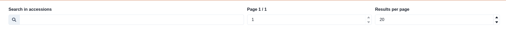
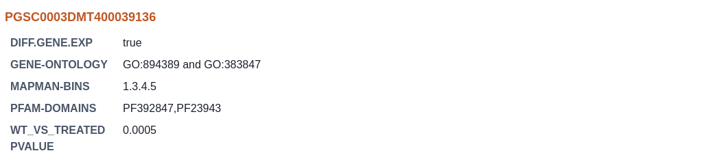

# Gene Browser

The gene browser tool enables you to search and inspect the data and meta-data you uploaded for your genes. You can access the gene-browser via the **Tools** page by clicking on the **Gene Browser** card.


All data and searches are private to your browser and will not be sent anywhere


### Toolbar

At the top of the window you can use the toolbar to search and paginate through your accession. The search will be executed on the accession as well as all the meta-data available for your genes.

### Gene cards

The gene cards display the meta-data available for a specific gene taken from your uploaded **info\_table**.

### Gene details

When double clicking on a specific gene card you will be presented with a table showing the expression data for your experiments on that gene.

