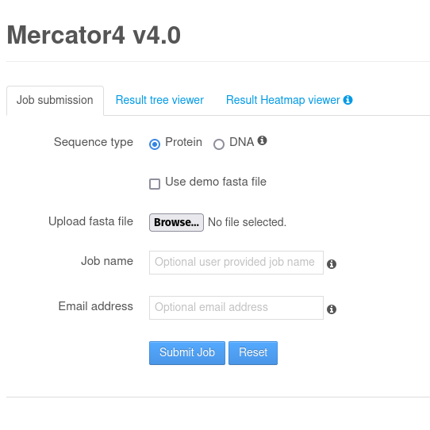

# MapMan functional Annotations

### Run Mercator v4 on your transcripts

GXP offers you to run Mercator v4 on your genes by linking to the **plabipd** online resources for [Mercator](https://plabipd.de/portal/mercator4). Clicking on the **Mercator v4** card will redirect you to the tool.



Follow the instructions on the webpage and upload your fasta file to start a job for running the Mercator pipeline.

Once ready, you will recieve an email and the tabular output with the MapMan annotations for your transcripts.

### Load the tabular Mercator output

Once you have the tabular Mercator output for your transcripts ready you can upload it either via the **Import Mercator output** card or via the **Load Mercator Table** Button in the Sidebar of the **Data** page. You will be presented with the following form:


Select your Mercator file and click on **Load** to load the table. The table will be parsed and automatically written as columns into the in memory **info\_table**. Each transcript annotated with one or more MapMan Bins will have that information available automatically.


After loading your mercator table, you can check the gene-browser if your columns are present


Optionally you can also add the Mercator **Name** and **Description** columns to your data.

## Add your own templates


This feature is for advanced users and needs manual changes to the code base


If you want to add your own templates for MapMan to the application you can do so relatively straight forward. Everything you need for that is the template as **svg** and and a corresponding MapMan **xml** file that describes the position of the bins, shown in the template.

If you are familiar with the [MapMan Java application](https://mapman.gabipd.org/mapman-download), you can generate those directly via that tool.

Otherwise you can in theory manually create the **xml** file.&#x20;

### MapMan template XML specification

The **xml** describing the bins to be displayed in the corresponding svg needs a specific format to be read by the GXP. Have a look at the [mapman-templates](https://github.com/usadellab/GeneExpressionPlots/tree/main/public/mapman-templates) already inside the GXP to get an idea of how they need to look like.

* **Header** xml Header

```
<?xml version="1.0" encoding="UTF-8"?>
```

* **Image** describes the corresponding svg

```
<Image image="M4_Amino_acid_metabolism_r1.1" size="1024x724" modified="2020-07-24 14:35:47.580108" scaling="1.0">
```

* **DataArea(s)** set coordinates for the MapMan bins. The **blockFormat** describes how many rows or columns a matrix displayed at that location should have (x5 -> max 5 columns; y5 -> max 5 rows).

```
<DataArea x="232" y="141" visualizationType="1" blockFormat="x5">
    <Identifier id="4.1.1.1.3" recursive="true"/>
</DataArea>
```

### Add the template / xml to the code base

If you have the template as **svg** and the corresponding **xml**, you can add them to the code base.


Make sure they have the same file name (except the extension)


Two steps are required for that:

1. Add the two files to the [mapman-templates](https://github.com/usadellab/GeneExpressionPlots/tree/main/public/mapman-templates) folder in `/public`&#x20;
2. Add a mapping for your files to the `templates` constant in the [mapman-form component](../../../src/pages/plots/components/mapman-form.tsx) (line 42). Your template needs a value that points to the filenames and a label for displaying the option in the MapMan-plot form.

```javascript
const templates = [
  {
    label: 'Amino acid metabolism',
    value: 'X4.3_Amino_acid_metabolism_R3.0',
  },
  //...
  // Add your own template here, for example
  {
    label: 'my template'
    value: 'my_template' // This needs to correspond to
                         // your filenames (no extension)
  }
}
```
