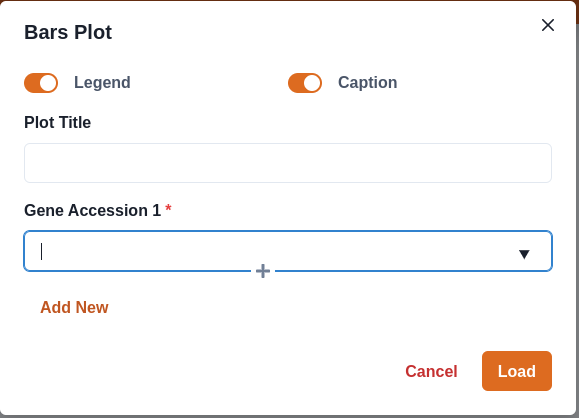
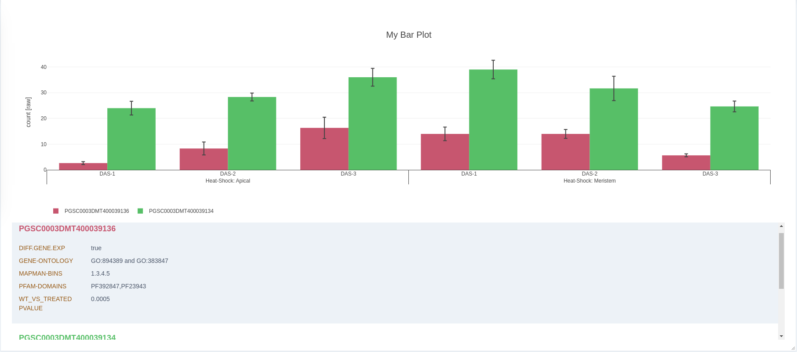
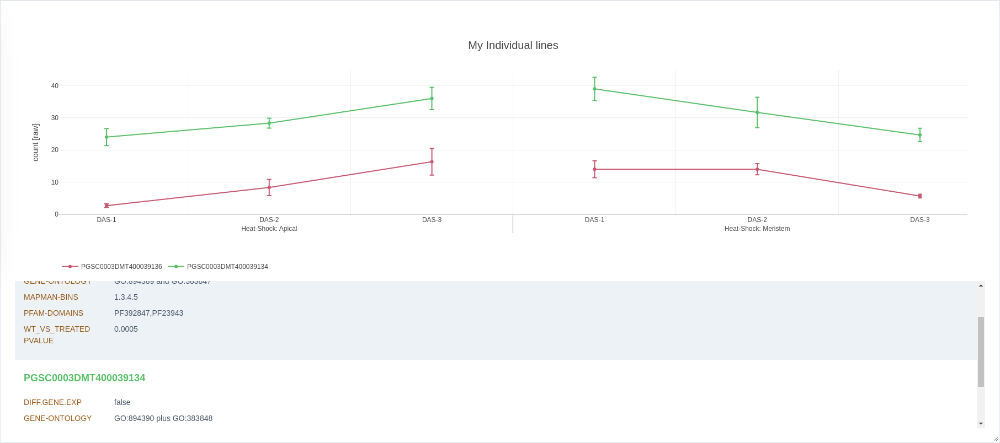
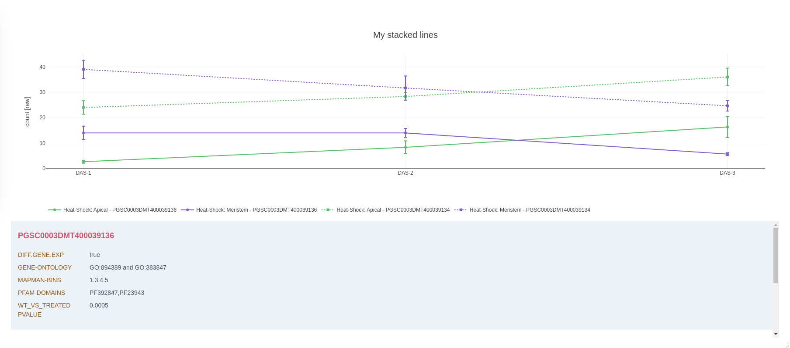
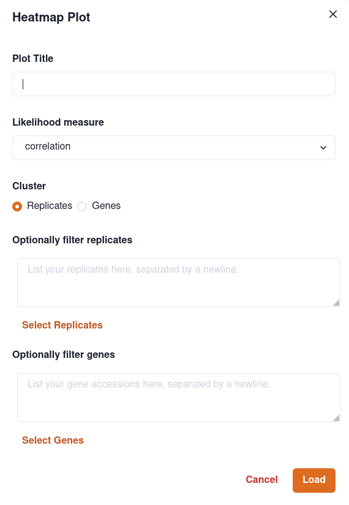
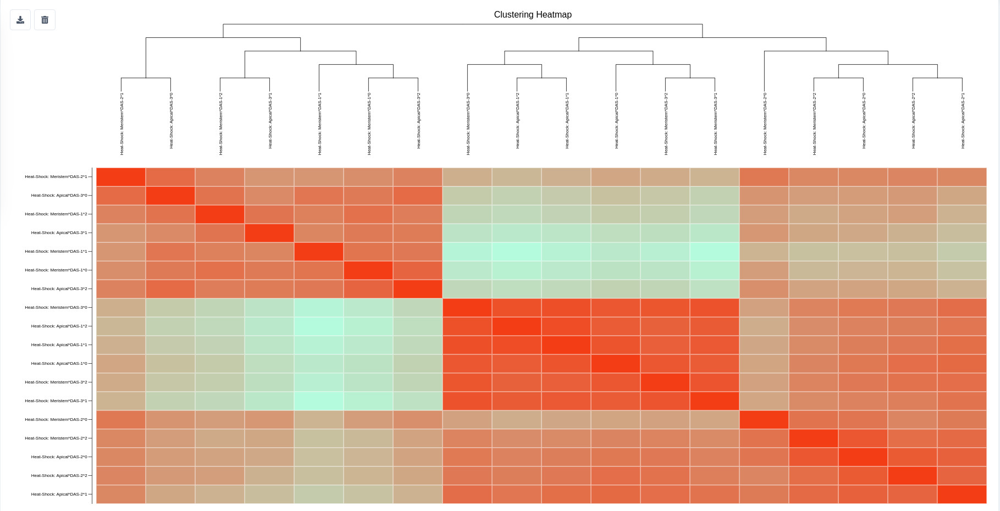
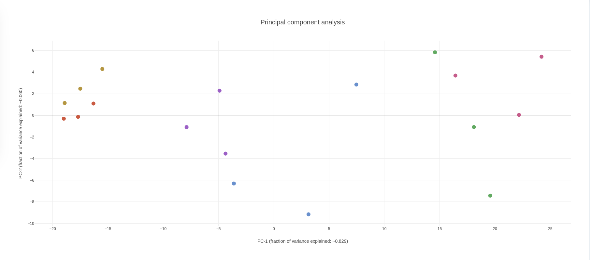
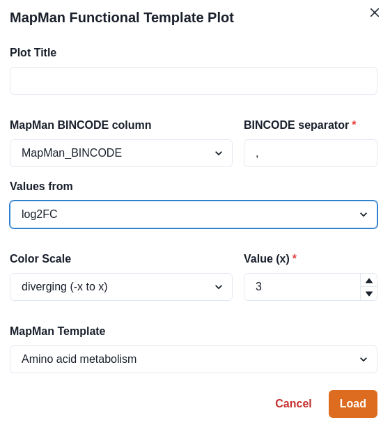
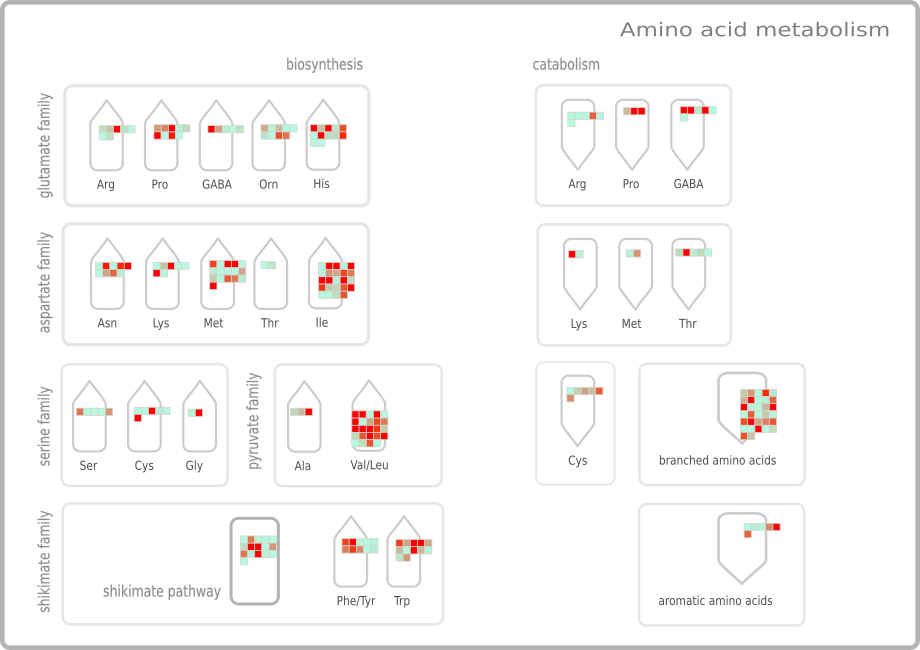
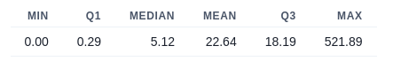

# Plots

Once the application is loaded with your data you can add different **Visualizations** to the application via the **Plots** page that can assist your scientific understanding of the underlying data via powerful tools to interactively inspect and compare different aspects of your experiments. You can choose multitude of different visualization types via the pages Sidebar:&#x20;

## Plot your expression data

There are three different visualizations to directly plot the raw expression counts for specific genes from your data. All of which will use a **Form** like this to supply the application with your desired inputs:

The above form enables you to use automatic legend and captions for the plotted genes as well as choosing the genes you want to visualize via a drop-down menu that searches for your input.

You can select multiple Genes to plot by adding them to the list either via the **Add New** Button or clicking the **Plus** icon inside the input field.

### Bars

The **Bars plot** will visualize the chosen genes counts via bars. The **y-axis** will show your counts and the **x-axis** displays the the genes in the different expiremental factors used to set up your expirement. The count will be displayed as the mean for all replicates of a specific experiment with error bars showing the standard deviation of said replicates.

### Individual lines

The **Inidividual lines plot** is equivalent to the bars plot, but uses lines to display the expression trend of the selected genes over the course of the experiments.

### Stacked lines

Like bars and individual lines the **Stacked Lines Plot** displays your expression counts on the **y-axis.** In contrast to the other two plot types the **x-axis** is divided only into the different samples (experiements) and the information about the group (for example the tissue type) is displayed via a separate curve. In the form you can select to color by gene or by group.

## Cluster your data

You can cluster your replicates using hirarchical clustering via **agglomerative nesting (agnes)** and display the results via a heatmap showing the replicate euclidean distances.

To open the form click on the **Cluster Heatmap** option in the Sidebar. This will open a form where you can select a title, what to cluster, a likelihood measure and optionally filter by replicates and/or genes.

For now we support two different methods of calculating likelihood between your replicates/genes. By default we use a correlation based measure, if wanted you can switch to simple euclidean distances.

To filter for repliaces and/or genes you can either copy/paste a list of values separated by a newline into the textareas or choose from the list of uploaded replicates/genes by clicking on the **Select Replicates/Genes** button.

Clicking on the **Load** Button will run the computation of the clusters in the background using [Webworkers](https://developer.mozilla.org/de/docs/Web/API/Web\_Workers\_API). Once the calculations are done you will be able to see the resulting heatmap and tree:

## Principal Component Analysis

You can run a Principal Component Analysis (PCA) on your replicates using the **PCA** option on the sidebar.&#x20;

You will be presented with a form very similar to the **Cluster Heatmap** form where you can select what to analyze and filter genes/replicates.

The resulting plot will show the the graph of the first two principal components explaining most of the variance between the replicates:

## MapMan functional templates

GXP offers the possibility to use [MapMan functional annotations](https://www.sciencedirect.com/science/article/pii/S1674205219300085) for the loaded transcripts to plot an overview of expression of chosen numeric values onto a number of [diagrams](https://mapman.gabipd.org/mapmanstore?p\_p\_id=MapManDataDownload\_WAR\_MapManDataDownloadportlet\_INSTANCE\_4Yx5\&p\_p\_lifecycle=0\&p\_p\_state=normal\&p\_p\_mode=view\&p\_p\_col\_id=column-1\&p\_p\_col\_pos=1\&p\_p\_col\_count=2) depicting metabolic pathways or other processes.


If you don't have annotated your transcripts with MapMan bins, you can do so online via the Mercator Software [here](https://plabipd.de/portal/mercator4). After doing so follow the instructions on [how to load the annotations into your GXP tool](https://zendro-dev.gitbook.io/geneexpressionplots/documentation/user-manual/mapman-functional-annotations).

The Plot only works if your additional gene information table (info table) includes a column for the annotated MapMan Bins for each gene.


To open the form to create a MapMan functional plot click on **MapMan function** button on the plot sidebar. The following form will be presented

The form enables you to customize the MapMan plots to your specific needs via a number of options you need to specify:

* **Plot Title:** optional Title for your Plot
* **MapMan BINCODE column:** Select the column from your gene info table that holds MapMan BINCODE(s).
* **BINCODE separator:** In-column separator for MapMan BINCODEs, in case a gene is annotated with multiple bins.
* **Values From:** Select where to get the values to be plotted from. Can be any numeric value from the info table or mean expression values for a specific sample.
  * You can either choose from any of your info table columns **OR**
  * Use Mean expression values for a specific sample of your expression data.
* **Color Scale:** Select a color scale for your values.&#x20;
  * **divergent:** Will use a divergent colorscale (blue - white - red) from `-x` to `x` for your numeric values. If you want to use `log2FC` or simial values, choose this.
  * **continuous:** Will use a continuous colorscale (lightgray - orange) for the chosen range.
* **MapMan Template:** Choose the MapMan diagram to use as a template for your plot.&#x20;

After finishing the form the plot will be calculated and displayed in your plots page:

For every MapMan Bin in the chose template, all genes that are annotated to that Bin are plotted as a rectangle using the numeric value you choose in the **Values From** option in above form.

When hovering over a rectangle additional information about that gene will be displayed, including the **identifier**, the **BINCODE** and the **value**.

To give an understanding of the distribution of plotted values (could for example be used to guide you in choosing a suited colorscale) a table with some statistics about the plotted values is included:

You can also adjust the Box size using the control element below the plot.


In case you want to change the positions or matrix dimensions of your templates, you can directly edit them as described [here](https://zendro-dev.gitbook.io/geneexpressionplots/documentation/user-manual/mapman-functional-annotations#add-your-own-templates). You can also add your own templates and use those for your GXP application.&#x20;

